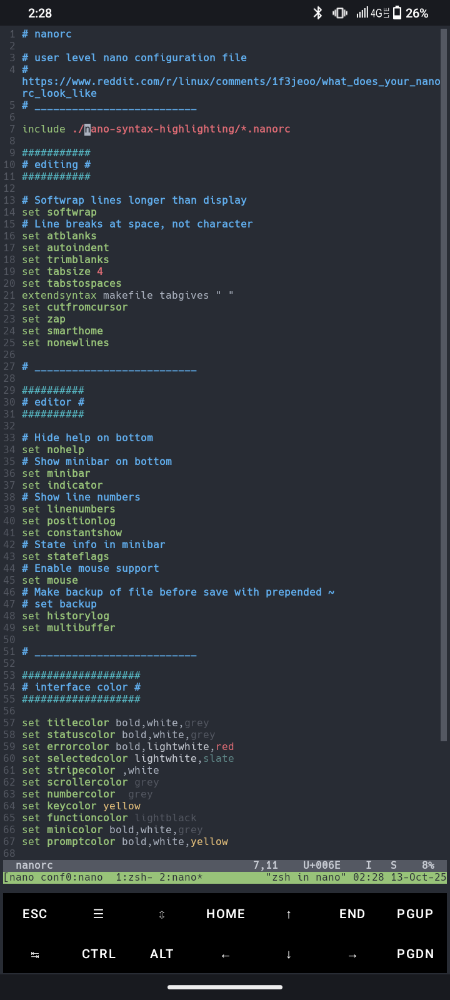

# Nano Settings

__Home__ __|__ [Todo](TODO.md) __|__ [Additional Docs](docs/README.md)

---
> *Modernizing the most dissed editor on the command line...*
---

- Modern key bindings
- Improved color schemes
- Better, more modern interface
- Only the best options enabled

